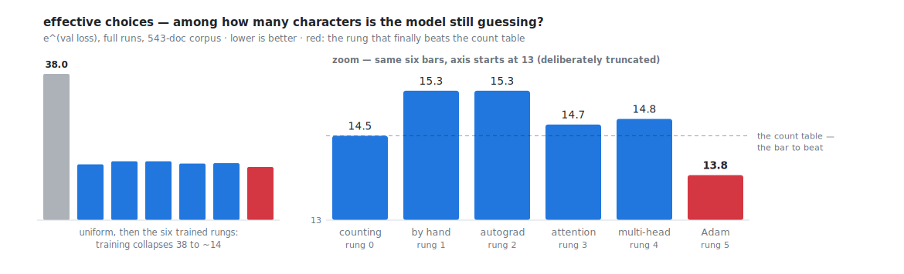

# microbrain

**Build a GPT you can hold in your head — trained on the names of your ideas.**



This is [Karpathy's microgpt](https://gist.github.com/karpathy/8627fe009c40f57531cb18360106ce95)
— a complete GPT in ~200 lines of dependency-free Python — unrolled into a
course you *walk*. (GPT: the family of text-predicting models behind
ChatGPT.) His six published build-steps, ported onto a personal corpus.
Instrumented, so every claim is a number you printed. Illustrated, with
diagrams the code draws from its own weights. Extended, with the two rungs
readers always ask for next. Pure Python standard library, beginning to end.
No pip install. Ever.

The promise: you know Python but not ML. You walk the rungs in order over a
weekend. You leave holding the deep intuitions — what a loss *is*, why
autograd exists, what attention buys, what an optimizer decides, why models
memorize or don't — plus a 106 KB `model.json` you trained, killed,
resurrected, and shipped as a working name-generator.

Every term above is defined, in order, inside the lessons — with a
[glossary](GLOSSARY.md) for lookups. If the Python-and-terminal side is new
too, read with an AI agent alongside; it fills gaps on demand.

## Quickstart

```
python train0.py                # instant — the corpus ships with the repo
python train1.py                # ~10 s
```

Then read `lessons/train0-counting.md` — the lessons assume you run first, read
second. Three practical notes:

- `python` means your Python 3; some systems spell it `python3`.
- The corpus is committed: `data/data.txt`, 511 idea names from the author's
  knowledge base (lightly curated — a few dozen private slugs removed;
  [data/MANIFEST.txt](data/MANIFEST.txt) pins the exact file). So every
  number in the lessons reproduces on your machine, out of the box. Prefer
  your own corpus? `python data/make_dataset.py --names` downloads Karpathy's
  32k human names, `--from yourlist.txt` trains on any file of short strings,
  and `MICROBRAIN_DB=~/my-store/records` harvests your own db.md brain.
- Worth doing from the start: `mkdir -p out`, then run each rung as
  `python trainN.py | tee out/trainN.log` (`tee` shows the output *and*
  saves it). `compare.py` builds the final ladder from those saved logs.

Then keep climbing. Honest timings on a laptop (pure-Python, one number
at a time — the slowness is the point, not a flaw): train2 ≈ 7 min, train3–train6 ≈ 8–9 min each,
train7 ≈ 15 min for all six runs (five surgeries plus the baseline). Every
rung from train1 up takes `--fast`: 300 steps instead of the full 1,000
(train7's lab drops to 100 per surgery). That's seconds on the early rungs
and a few minutes on the heavy ones — the shape without the wait. And
`python compare.py` prints the whole ladder from whatever logs you've
produced and fast-runs the gaps.

Each lesson ends with three exercises: **predict-then-run** (commit before the
machine answers), **break it** (sabotage with a diagnosis — the crashes are real
and were observed), and **extend it** (the gradcheck grades your calculus).
Do them. The course's actual thesis is that intuition comes from predictions
you got wrong in private.

Concepts arrive in plain words, in order, each defined the first time it's
needed — and everything lives in the [glossary](GLOSSARY.md) with its aliases
("cross-entropy, aka negative log-likelihood, aka rung 0's *surprise*"), so a
term met mid-course is never more than one lookup away.

**Agent-native.** The reading is for you; the terminal work is optional —
any AI agent makes a fine lab partner for it. Have it run the rungs, produce
and explain the diff between any two files, referee your exercise
predictions, or chase a tangent. Everything an agent needs is in-repo:
pinned canon in `reference/`, deterministic seeds, the author's logs in
`runs/` — and `python tools/check.py` verifies the repo's consistency gates
(every link, every code snippet, the core evidence lines) in one command.
*Following the course* never requires running anything at all — though
training your own and hitting the quiz is the whole fun.

## The ladder

Each rung is one runnable file and one short lesson. One new idea per rung —
everything else is frozen scaffold from the rung below, and **every lesson
shows the exact new lines inline**, verbatim from the file, with the full
file one click away. You never need a terminal diff to follow the idea (the
files stay adjacent and diffable for those who like it, or for your agent).
From rung 3 on, every file trains the same tiny GPT — vocab 38 · dims 16 ·
context 40 · **1 layer** · 4,928 params, single-head at rung 3 and 4 heads
from rung 4 — the dials printed on the
[architecture diagram](assets/architecture.svg). Numbers below are from full
runs on this repo's corpus (511 idea names, 38-token vocabulary, 10% held
out):

| rung | file | the one new idea | val loss | effective choices¹ |
|---|---|---|---|---|
| — | — | uniform shrug (no model) | 3.6376 | 38.0 |
| 0 | [train0.py](train0.py) · [lesson](lessons/train0-counting.md) | bigram by **counting** | 2.6764 | 14.5 |
| 1 | [train1.py](train1.py) · [lesson](lessons/train1-gradient-descent.md) | **gradients, by hand** (SGD) | 2.7239 | 15.2 |
| 2 | [train2.py](train2.py) · [lesson](lessons/train2-autograd.md) | **autograd** — same numbers, ~43× slower, Karpathy's file gets *shorter* | 2.7239 | 15.2 |
| 3 | [train3.py](train3.py) · [lesson](lessons/train3-attention.md) | **attention** + positions + residuals + rmsnorm | 2.6796 | 14.6 |
| 4 | [train4.py](train4.py) · [lesson](lessons/train4-multi-head.md) | **multi-head** — same param count, four spotlights | 2.6875 | 14.7 |
| 5 | [train5.py](train5.py) · [lesson](lessons/train5-adam.md) | **Adam** — the count table finally falls | **2.6165** | **13.7** |
| 6 | [train6.py](train6.py) · [lesson](lessons/train6-inference-toolkit.md) | *(ours)* save/load, temperature, the KV cache measured, the quiz | 2.6165 | 13.7 |
| 7 | [train7.py](train7.py) · [lesson](lessons/train7-ablation-lab.md) | *(ours)* the ablation lab: break it on purpose, organ by organ | — | — |
| end | [namer.py](namer.py) · [epilogue](lessons/epilogue.md) | your model as a tool; the bridge to production | — | — |

¹ `e^(val loss)`: out of 38 possible next characters, how many is the model
still effectively guessing among? Uniform = 38, perfect = 1. (An untrained
model can even score *above* 38 — rung 3 opens there.) The standard name is
perplexity. Watch it fall down the ladder, 38 → 13.7 — the bumps at rungs 1
and 4 are lessons, and the lessons own them.

The mid-ladder plot twist is real and deliberate: **a complete GPT loses to a
count table for two straight rungs** (14.6, 14.7 vs 14.5) until the optimizer
rung lands. The architecture was never the bottleneck. Rung 5's lesson is
where that sinks in.

Every number in the lessons comes from the committed corpus — one frozen
snapshot, shipped as `data/data.txt` and hash-pinned in
[data/MANIFEST.txt](data/MANIFEST.txt) — and the runs are deterministic:
clone, train, and your logs match the lessons digit for digit. Your own corpus (`--names`, `--from`) gives
different numbers — and, measured, a partly different plot
([runs/names-ladder.log](runs/names-ladder.log)): on Karpathy's 32k names
the mechanisms replay exactly (train1 and train2 still match to the digit;
gradient descent still loses to counting; Adam still wins the ladder,
11.7 → 10.5 of 27) — but attention beats the count table under plain SGD
already, because ~55× the data moves the optimizer bottleneck. Rung 5's
moral survives either way: an outcome belongs to architecture *and*
training *and* data, never one alone. That names track doubles as the
anyone-can-reproduce lane: no brain required — run `--names`, walk the same
rungs, and set your panels against that committed log.

## What's in the box

```
train0.py … train5.py    the canon — Karpathy's six build-steps, ported (block 40, vocab 38)
train6.py  train7.py     ours — the inference toolkit and the ablation lab
namer.py                 the payoff: out/model.json (train6's output) as a name-generating tool (try --quiz)
compare.py               the ladder on one screen
data/                    data.txt, the committed 511-name corpus (MANIFEST.txt pins it) + the harvester
lessons/                 one lesson per rung + the epilogue
GLOSSARY.md              every term in plain words, with its aliases and the rung
                         where it's earned — for mid-course lookups
runs/                    the author's full logs, plus exercises.log from the break-it runs —
                         lesson excerpts are quoted verbatim from these files
tools/                   render_svgs.py draws assets/ from the logs; check.py runs the
                         repo's eight consistency gates (links, snippets, quoted numbers)
reference/               pinned snapshots of both Karpathy gists, fetched revision by revision
PROGRESSION.md           the published ladder + the gist's own revision story (243 → 199 lines)
```

Requirements: Python 3 (developed and verified on 3.12). Nothing else — no
pip, no venv, ever.

Every train file is self-contained on purpose — dataset, tokenizer, `Value`
class repeated verbatim so adjacent files diff clean. The instruments are the
other constant: train/val loss, effective choices, and a memorization gauge
(what fraction of samples are verbatim training docs — it reads 0/20 all
course, and train6 explains why that's the *interesting* outcome). Plus one
diagram per rung, drawn from the live model: the count table as a heatmap, a
loss valley, a computation graph with grades you can check by eye, attention
maps, the SGD-vs-Adam race, and the childhood album:

```
step    0 | m129o8dwl-x7nfi1o8kliw13m-uvwax1c7omlpp6, fpx3bbb2kk73p9lfqj3pl, iqz, ...
step   50 | rat--ye, jantinb-lako, el-orta-lbaures-t, ...
step  250 | padereange-dinulintti-manatin-s, henge-en, larenatingasening, ...
step 1000 | ag-ong, arense-arereinit-mare, moderar, vem-santt-romantinion, ...
```

That's one model, photographed at four ages, learning the shape of idea names
from pure static (random noise) — the whole childhood, eight and a half
minutes of laptop time.

## Credits

The algorithm, the ladder, and the aesthetic are
[Andrej Karpathy's](http://karpathy.github.io/2026/02/12/microgpt/). microgpt
is the culmination of micrograd → makemore → nanoGPT; this repo is a study
of it, not a replacement. Read
[PROGRESSION.md](PROGRESSION.md) for what his revision history itself
teaches. The corpus is the record slugs of a personal db.md knowledge store (plain-file
databases) — swap in your own list of short strings (`--from`) and the whole
course retrains on *your* world in an hour.

License: MIT for this repo's original material; the `reference/` snapshots
remain Karpathy's, vendored for study with attribution — see
[reference/README.md](reference/README.md) and [LICENSE](LICENSE).
