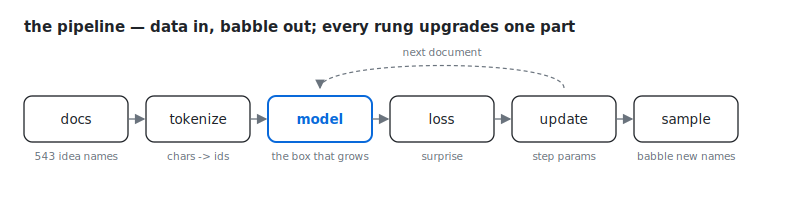
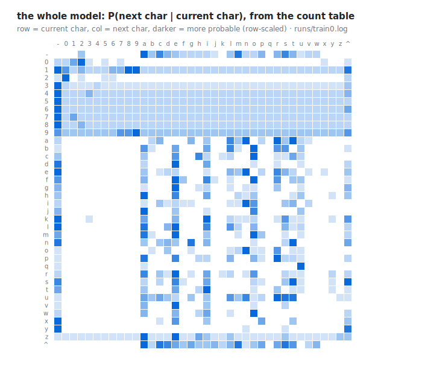

# train0 — counting

> The question this rung answers: **what is the smallest thing that can invent an idea name?**

```
docs -> tokenize -> model -> loss -> update -> sample
^^^^^^^^^^^^^^^^^^^^^^^^^^^^^^^^^^^^^^^^^^^^^^^^^^^^
you are here: the whole machine, smallest possible version
```

*New this rung:* [bigram](../GLOSSARY.md#bigram) · [BOS](../GLOSSARY.md#bos) · [closed-form](../GLOSSARY.md#closed-form) · [corpus](../GLOSSARY.md#corpus) · [cross-entropy](../GLOSSARY.md#cross-entropy) · [effective choices](../GLOSSARY.md#effective-choices) · [heatmap](../GLOSSARY.md#heatmap) · [Laplace smoothing](../GLOSSARY.md#laplace-smoothing) · [loss](../GLOSSARY.md#loss) · [nats](../GLOSSARY.md#nats) · [parameters](../GLOSSARY.md#parameters) · [sampling](../GLOSSARY.md#sampling) · [shrug](../GLOSSARY.md#shrug) · [state_dict](../GLOSSARY.md#state_dict) · [token](../GLOSSARY.md#token) · [val / validation set](../GLOSSARY.md#val--validation-set) · [vocabulary](../GLOSSARY.md#vocabulary) — every term links to the [glossary](../GLOSSARY.md).

Every rung of this course is this same pipeline. Only the `model` box will grow.
Today it is a table of counts, and yet the whole loop is already present:
data in, predictions out, a number that says how wrong we were, an update that
makes us less wrong, and sampling that babbles something new. Hold onto this
shape. Nothing else will be added — only upgraded.



## Walk the code

**The data** is 511 idea names from a personal knowledge base, one per line —
`test-time-training`, `geva-2021-ffn-kv-memory`, `patient-hm`. We keep the last
52 locked in a drawer (`val_docs`) and never train on them. Everything we
*trust* gets measured on that drawer.

**The tokenizer** is an alphabet. 37 characters appear in the corpus; each
becomes an id. One extra token, BOS, marks both the start and the end of a name
— the model begins from it, and emitting it means "I'm done." Vocabulary: 38.

**The model** is `state_dict[i][j]`: how many times token `j` followed token
`i`. That's it — a **bigram** model, the two-token pattern: this character,
next character, nothing else. The whole model is 38 rows × 38 columns —
1,444 numbers, every one of them a count. To predict, normalize row `i` into probabilities. We add one
imaginary count to every cell (Laplace smoothing) so nothing has probability
exactly zero — "never say never," for reasons the break-it exercise makes vivid.
The entire model, from [train0.py](../train0.py):

```python
# The "model": given a token_id, return the probability distribution over the next token
def bigram(token_id):
    row = state_dict[token_id]
    total = sum(row) + vocab_size # add-one (Laplace) smoothing
    return [(c + 1) / total for c in row]
```

And the entirety of "training" — three lines inside the loop:

```python
    # Update the model: incorporate this document's bigram counts
    for pos_id in range(n):
        token_id, target_id = tokens[pos_id], tokens[pos_id + 1]
        state_dict[token_id][target_id] += 1
```

**The loss** is `-log P(the char that actually came next)`. Read it as
*surprise*: probability 1 → surprise 0; probability 1/38 → surprise 3.6376 (measured in
*nats* — bits' natural-log cousin: same idea, log base e); probability → 0 →
surprise → ∞. A language model is a machine for being less
surprised by what actually happens.

**The loop** quizzes before it counts: each document's loss is computed with
the counts from *before* that document. The model is always graded on
something it hasn't absorbed yet.

## What the numbers said

```
uniform loss: ln(38) = 3.6376 -> effective choices: 38
step    1 /  459 | loss 3.6376
step  400 /  459 | loss 2.4930
step  459 /  459 | loss 2.9104

train loss 2.6220 | val loss 2.6764 | effective choices 14.5 of 38
```

Three things worth staring at:

- **Step 1 is exactly 3.6376.** Before any counts, smoothing makes every row
  uniform — the model's first answer is a shrug, and the math says a shrug
  costs ln(38) nats.
- **The per-step loss bounces** (2.49 at step 400, 2.91 at step 459). Each step
  quizzes on one document, and some documents are just weird. Only the averaged
  panel line at the bottom deserves your trust. This stays true all course.
- **Effective choices: 38 → 14.5.** This is `e^(val loss)`, and it's the most
  honest way to read any loss in this course: *the model is now choosing among
  ~14.5 characters instead of 38*. (The standard name for this is perplexity.)
  Counting alone cut the alphabet by more than half.

The model also drew itself. Here is the entire model as a picture, rendered
from the run's log (your terminal prints the same grid in ASCII, shade ramp
`.` `:` `-` `=` `+` `*` `#` `%` `@`, light to dark):



Two rows to find:
`q`, which is nearly a single dark cell (`u`, 0.24 — the corpus's `qwen`s and
`quantization`s at work), and the BOS row, whose favorite openers are `a`, `c`,
`m`. And the samples are glorious garbage: `n-cernv4c-ck-boncor-steave-...`,
`niosta-dag`, `xtu3qdy`. From two meters away they look like idea names. From one meter
they mean nothing. That texture-without-structure is exactly what one character
of context buys — and 0/20 samples were verbatim training docs, so even this
tiny thing isn't parroting.

## The idea to keep

Counting is a **closed-form solution**: a direct, exact formula. One pass
over the data computes the provably best possible bigram table. This is the
only rung with that luxury, and the table's exactness has a price with two
parts: rows multiply by 38 per character of context (exercise 3 measures
that wall), and every row learns *alone* — a thousand sightings of `-tion`
teach the `-sion` row nothing. The moment the model gets more expressive —
two characters back, the shape of a whole word — no formula can fill the
table, and no corpus can either. That is the course's hinge, in Karpathy's
words: *gradient descent is what
you need when the model is too expressive for exact solutions.* Rung 1
rebuilds today's exact answer with the approximate method, on purpose — so
you can watch the method work before it faces problems with no exact answer.

## Exercises

**1. Predict, then run.** Before opening the heatmap: which character most
often follows `-`? And which character most often comes right *before* a
digit? Commit to both, then run `python train0.py` and check the rows.

**2. Break it.** Delete the smoothing: `total = sum(row)`, and `c / total`
instead of `(c + 1) / total`. Predict what happens and *when*, precisely.
Then run it.

**3. Extend it.** Make it a trigram model: condition on the previous *two*
tokens. How big is the table now? How many of its rows did 459 training docs
actually visit? At what n-gram size does counting stop being a viable plan?

<details>
<summary>Solutions</summary>

**1.** After `-`: `a` (0.11), then `m`, `s`. Before a digit: `-` (48 times
in the training docs), then `2` and `0` — digits follow hyphens and other
digits (`gpt-4`, `2025`); a letter almost never touches a digit directly.

**2.** It dies *instantly* — `ZeroDivisionError` at the very first `bigram()`
call of step 1. Not eventually: the quiz-before-counting loop asks the model
about document 1 while the table is still all zeros, so the first row it
normalizes sums to 0. Smoothing isn't numerical hygiene bolted on later; it's
what lets a model answer questions about things it hasn't seen. (Models die
at log-of-zero — remember the flavor of this crash.) Captured in
[runs/exercises.log](../runs/exercises.log).

**3.** Rows multiply by 38 per character of context. A trigram table
conditions on the previous *two* tokens: 38×38 = 1,444 rows of 38 numbers
(54,872 cells). Our 459 docs contain 9,168 trigrams (BOS-bracketed, the way
train0 tokenizes) and visit only 513 of those rows — a third; everywhere
else you'd be sampling pure smoothing. One
more character makes it 54,872 rows, ~96% of them never visited — counting
is already dead at 4-grams on this corpus. The table grows exponentially in
context length and the data doesn't; that wall is why the rest of this
course exists.

</details>

---

Next: [train1 — gradient descent, by hand](train1-gradient-descent.md). Same bigram question,
but the table becomes a neural network and learning becomes calculus.

[← home](../README.md) · [glossary](../GLOSSARY.md) · [train1 →](train1-gradient-descent.md)
