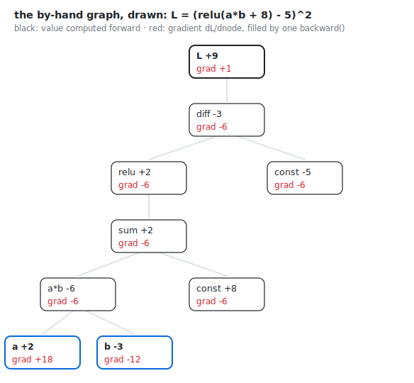

# train2 — autograd

> The question this rung answers: **who derives the gradients when the architecture changes every week?**

```
docs -> tokenize -> model -> loss -> backward -> update -> sample
                                     ^^^^^^^^
        you are here: the calculus writes itself
```

*New this rung:* [autograd](../GLOSSARY.md#autograd) · [computation graph](../GLOSSARY.md#computation-graph) · [tensor / scalar](../GLOSSARY.md#tensor--scalar) — every term links to the [glossary](../GLOSSARY.md).

(The map just grew a stage. `backward` existed inside train1 too — buried in
forty lines of hand calculus inside the update. Automating it is what earns
it a name on the pipeline.)

train1's backward pass was forty lines of careful, architecture-specific
calculus. It was also a dead end: change the model and you re-derive
everything. This rung replaces it with a machine that derives it for you —
and the file gets *shorter* (Karpathy's train2 is 156 lines to train1's 178).
Good abstractions don't add code. They delete the hardest code you have.

## Walk the code

The entire trick is a 40-line class. A `Value` wraps one number and remembers
two things: which Values it was computed *from* (`_children`), and how sensitive
it is to each of them (`_local_grads`). Multiplication knows its locals are
"the other guy's data." `log` knows its local is `1/x`. Nobody knows anything
global — each op knows only its own one-step derivative. Here is
multiplication, whole, from [train2.py](../train2.py) (`__mul__` is how a
Python class defines what `*` means for its objects):

```python
    def __mul__(self, other):
        other = other if isinstance(other, Value) else Value(other)
        return Value(self.data * other.data, (self, other), (other.data, self.data))
```

`backward()` then does the only clever thing in the file: a topological sort
(children before parents), walked in *reverse*, each node handing its
accumulated blame to its children, scaled by the local gradient. That's the
chain rule as a graph traversal — all of it:

```python
    def backward(self):
        topo = []
        visited = set()
        def build_topo(v):
            if v not in visited:
                visited.add(v)
                for child in v._children:
                    build_topo(child)
                topo.append(v)
        build_topo(self)
        self.grad = 1
        for v in reversed(topo):
            for child, local_grad in zip(v._children, v._local_grads):
                child.grad += local_grad * v.grad
```

The forty lines of train1 calculus fall out as a special case, and so does
every architecture we'll ever build on top.

The file opens with a graph small enough to check by hand —
`L = (relu(a·b + 8) − 5)²` with `a=2, b=−3` — and prints it, post-backward:

```
L     data +9.0000 | grad +1.0000
    diff  data -3.0000 | grad -6.0000
        relu  data +2.0000 | grad -6.0000
            sum   data +2.0000 | grad -6.0000
                a*b   data -6.0000 | grad -6.0000
                    a     data +2.0000 | grad +18.0000
                    b     data -3.0000 | grad -12.0000
                const data +8.0000 | grad -6.0000
        const data -5.0000 | grad -6.0000
```

The same graph, drawn:



Trace one path yourself: dL/ddiff = 2·diff = −6; the adds and the (positive)
relu pass it through untouched; at the product, `a` inherits −6 times *b's*
data: −6 × −3 = **+18**. The printout agrees. Every gradient you will ever
compute in this course is this move, repeated.

Then the same class, at scale:

```
one document ('cscg-george-2021') builds a graph of 126,664 Value nodes
```

One sixteen-character idea name becomes a hundred twenty-six thousand
recorded operations, each carrying its own local derivative. One
`backward()` sweeps blame through all of them — with code you can read in a
sitting.

## What the numbers said

Put train1's log and train2's side by side:

```
train1:  step 1: 3.6369   step 501: 2.7682   step 1000: 2.5796   val 2.7301
train2:  step 1: 3.6369   step 501: 2.7682   step 1000: 2.5796   val 2.7301
```

Identical. Not similar — identical to every printed decimal, all the way down
to producing the same 20 samples at the end (`gentid`, `224`, `ice-an`...).
Same seed, same math, different author: in train1 you were the chain rule; in
train2 the graph is. This is the strongest possible verification that the
abstraction is faithful, and you get it for free by diffing two logs.

The price, measured on this laptop:

```
train1: training took 9.7s
train2: training took 433.8s
```

~45× slower. Every `+` now allocates an object instead of adding two floats.
This is the honest cost of flexibility, and it previews the epilogue: PyTorch
is, at heart, this same Value class where the "one number" is a million-entry
tensor — the bookkeeping amortized until it disappears.

## The idea to keep

Differentiation is *local*. No operation needs to understand the network; it
needs only its own derivative, and the chain rule — mechanically, humbly
applied 126,664 times — assembles global understanding out of local honesty.
This is why arbitrary architectures are trainable at all, and why the next
rung can bolt attention onto the model without anyone deriving a single new
gradient. The autograd engine is the reason deep learning is an *empirical*
science: you can afford to try things.

## Exercises

**1. Predict, then run.** 'cscg-george-2021' (17 predictions) cost 126,664
nodes. Roughly what will a 9-prediction document cost? Reason from structure:
what's shared between positions, what isn't? Then measure with `count_nodes`.

**2. Break it.** In `backward()`, walk the topo order forward:
`for v in topo:` instead of `reversed(topo)`. First predict what the by-hand
graph will print. Then predict what training will do. Then run both
(`--fast` is plenty).

**3. Extend it.** Give `Value` a `.tanh()`. Derivative: 1 − tanh². Then prove
yourself right the train1 way: perturb an input by 1e-5, measure `(L2−L1)/eps`
against the `.grad` your method produced.

<details>
<summary>Solutions</summary>

**1.** ≈ 69,000. Each position builds its own private ~7,200-node column
(the parameters are shared *leaves*, counted once: 4,064 of the total), so
nodes grow linearly with document length: 9 × ~7,200 + 4,064 + change.

**2.** Observed, both parts. The by-hand graph becomes a diagnosis you can
read: `L` grad +1, `diff` grad −6, everything deeper 0.0000. The reason:
walked forward, every node gives out its blame *before* it has received any.
`diff` gets its −6 only after its own turn has already passed, so the blame
stops there — one layer deep. And training? It runs without
any error — 300 steps, 199 seconds of flawless forward passes — and learns
nothing: val loss 3.6405, effective choices 38.1, at step 1, at step 151, and
at step 300. Frozen at the shrug. This is the nastiest failure mode in the
course: *no crash, plausible logs, zero learning.* Real-world variants of
"the gradients silently don't flow" have eaten whole research weeks; now
you've seen one from the inside.

**3.** `def tanh(self): t = math.tanh(self.data); return Value(t, (self,), (1 - t*t,))`.
The numerical check should agree to ~7 decimals; if it's off by exactly a
sign or a factor of 2, you now know how to find out which line lied.

</details>

---

Next: [train3 — attention](train3.md). The model finally gets to look left.

[← train1](train1.md) · [home](../README.md) · [glossary](../GLOSSARY.md) · [train3 →](train3.md)
